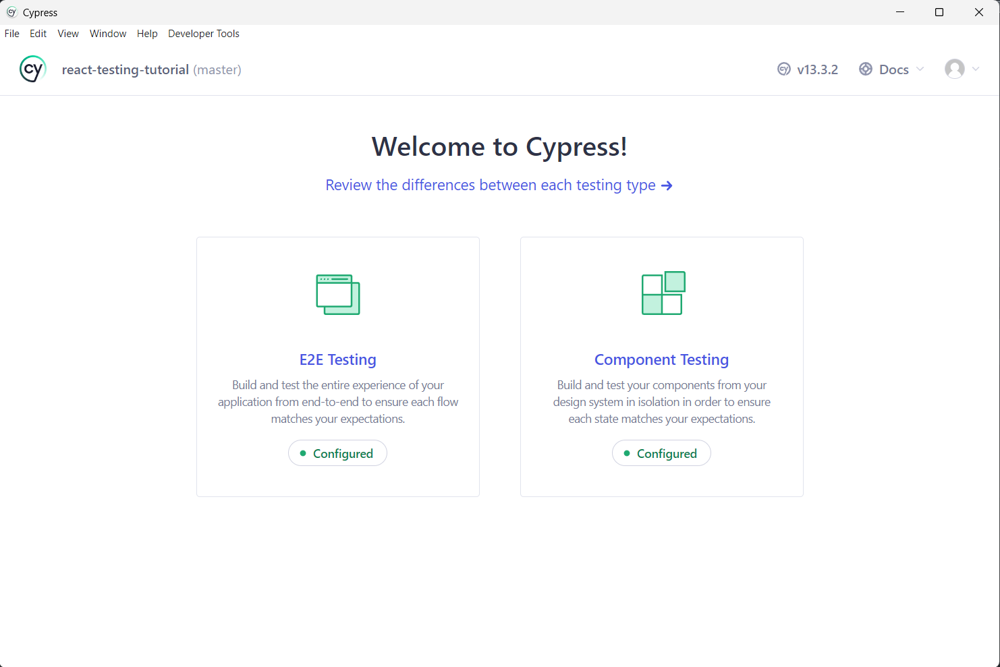

# Configuring Cypress and Jest for Testing in Typescript-Based React Application 🧑‍💻

Github project link: [react-testing-tutorial](https://github.com/Nazrin99/react-testing-tutorial)

## Purpose

The purpose of this project is to configure both Cypress and Jest framework for different tests in a **Typescript-based React Application**

## Framework Testing Scopes

Each framework will cover the following testing scopes: 

- Cypress

  1. Component testing
  2. End-to-End (E2E) testing

- Jest
  1. Unit testing
  2. Integration testing

## Installing Cypress

### 1. Install devDependencies

    npm install --save-dev cypress @tsconfig/cypress @types/cypress

### 2. Initialize the cypress configuration file

    npx cypress open

This will open a separate Cypress desktop application

Click on the **"Configured"** button. Note that if this is your first time configuring Cypress, the button should show **"Not Configured"** instead. Follow through the remaining prompts in the rest of the interfaces.

### 3. Configure [`tsconfig.json`](tsconfig.json) to include Cypress

Add the `cypress` folder to the `includes` block

    // tsconfig.json
    {
        // rest of the properties
        "include": ["src", "cypress"],
    }

We do this step because one of the most important function in Cypress, the `mount` function is located in the `cypress` folder. If we do not include this folder, there will be compile time errors when we call the function.

We will also add the Cypress types as well under `compilerOptions` property

    {
        "compilerOptions": {
            // rest of the properties
            "types": ["cypress"]
        }
    }

### 4. Creating testing folders

Any test scripts and thus folders should be created under the `cypress` folder since Cypress will by default search for test scripts in that folder

    cypress
    ├───fixtures
    ├───screenshots
    ├───support
    └───tests // Added folder and subfolders
        ├───components
        └───e2e

### 5. Modifying run scripts in [package.json](package.json) (Optional)

You can also choose to add new run scripts for running different tests. This is of course optional depending of your personal preferences. I have added the following `npm run` scripts for this project.

    //package.json
    {
        "scripts": {
            "open-cypress": "cypress open", // To open Cypress UI
            "open-component": "cypress open --component" // To open component test UI in Cypress
            "component-test": "cypress run --component" // To run component test
        }
    }

### 6. Running tests

Once you have written your test scripts, you can run the following command to run component tests

    npm run component-test

## Installing Jest

### 1. Installing devDependencies

    npm install --save-dev jest @types/jest ts-jest

### 2. Initialize jest configuration file

    npx ts-jest config:init

### 3. Adding preset and TS transformation properties to [`jest.config.ts`](jest.config.ts)

We need to include the preset and Typescript transformation properties to `jest.config.ts` so that the project will use `ts-jest` module to transform Typescript code in JavaScript code

    // jest.config.ts
    const config: Config = {
        preset: "ts-jest",
        transform: {
            "^.+\\.ts?$": "ts-jest",
            "^.+\\.tsx?$": "ts-jest",
        }
    }

### 4. Creating testing folders

For Jest, the following folder structure was created

    jest
    └───tests // Unit test scripts are added here

### 5. Modifying run scripts in [package.json](package.json) (Optional)

You can also choose to add new run scripts for Jest tests for your convenience. I have added the following `npm run` scripts to my project.

    // package.json
    {
        "scripts": {
            "test": "jest",
            "unit-test": "npm test",
        }
    }

## Installing `concurrently` package (Optional)

You can choose to install the concurrently package in order to group multiple `npm run` scripts into a single run scripts by running them concurrently, this could be helpful when trying to run full-suite for all types of testing.

    npm install --save-dev concurrently

Added the following `npm run` script in your [package.json](package.json) under the scripts blocks

    // package.json
    {
        "scripts": {
            "all-test": "concurrently \"npm run component-test\" \"npm run unit-test\""
        }
    }
