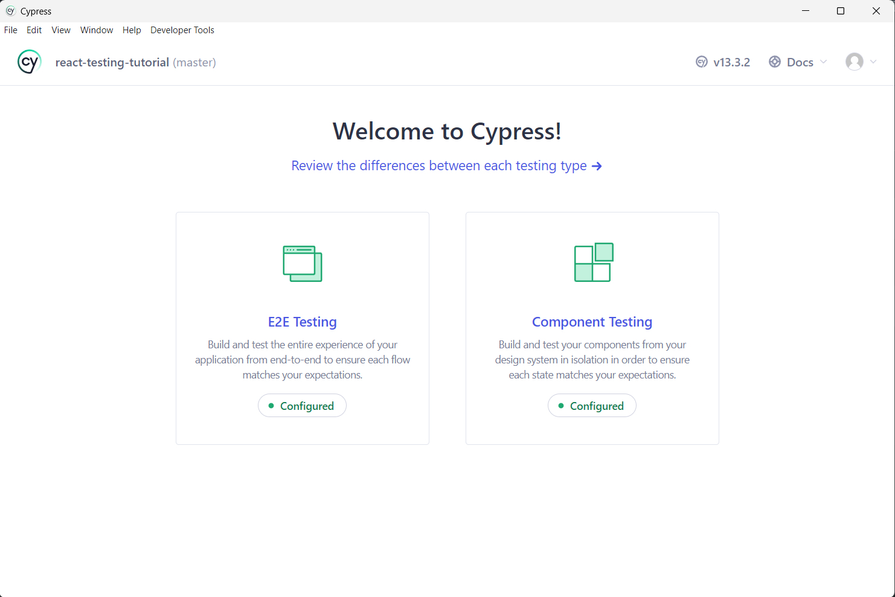

# Configuring Cypress and Jest for Testing in Typescript-Based React Application 🧑‍💻

Github project link: [react-testing-tutorial](https://github.com/Nazrin99/react-testing-tutorial)

## Purpose

The purpose of this project is to configure both Cypress and Jest framework for different tests in a **Typescript-based React Application**

## Framework Testing Scopes

Each framework will cover the following testing scopes: 

- Cypress

  1. Component testing
  2. End-to-End (E2E) testing

- Jest
  1. Unit testing
  2. Integration testing

## Installing Cypress

### 1. Install devDependencies

    npm install --save-dev cypress @tsconfig/cypress @types/cypress

### 2. Initialize the cypress configuration file

    npx cypress open

This will open a separate Cypress desktop application

Click on the **"Configured"** button. Note that if this is your first time configuring Cypress, the button should show **"Not Configured"** instead. Follow through the remaining prompts in the rest of the interfaces.

### 3. Configure [`tsconfig.json`](tsconfig.json) to include Cypress

Add the `cypress` folder to the `includes` block

    // tsconfig.json
    {
        // rest of the properties
        "include": ["src", "cypress"],
    }

We do this step because one of the most important function in Cypress, the `mount` function is located in the `cypress` folder. If we do not include this folder, there will be compile time errors when we call the function.

We will also add the Cypress types as well under `compilerOptions` property

    {
        "compilerOptions": {
            // rest of the properties
            "types": ["cypress"]
        }
    }

### 4. Creating testing folders

Any test scripts and thus folders should be created under the `cypress` folder since Cypress will by default search for test scripts in that folder

    cypress
    ├───fixtures
    ├───screenshots
    ├───support
    └───tests // Added folder and subfolders
        ├───components
        └───e2e
